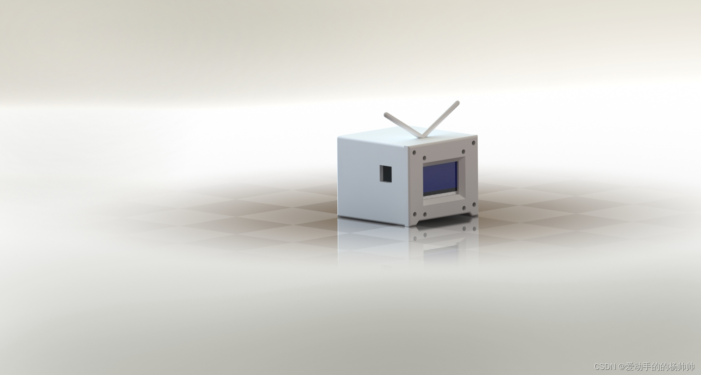
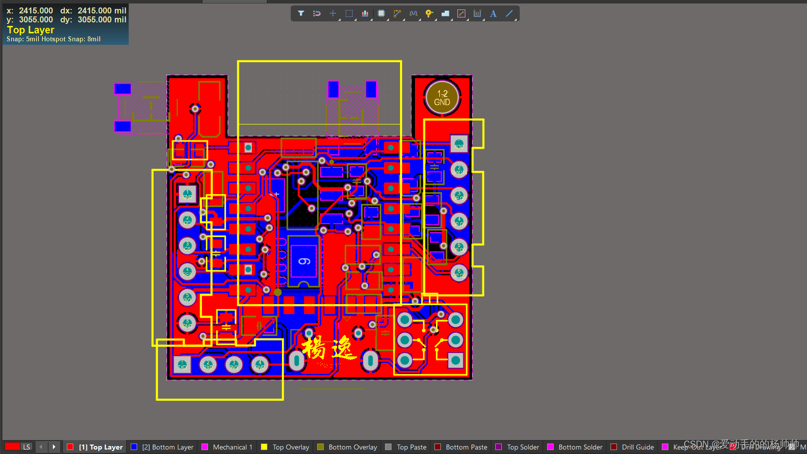
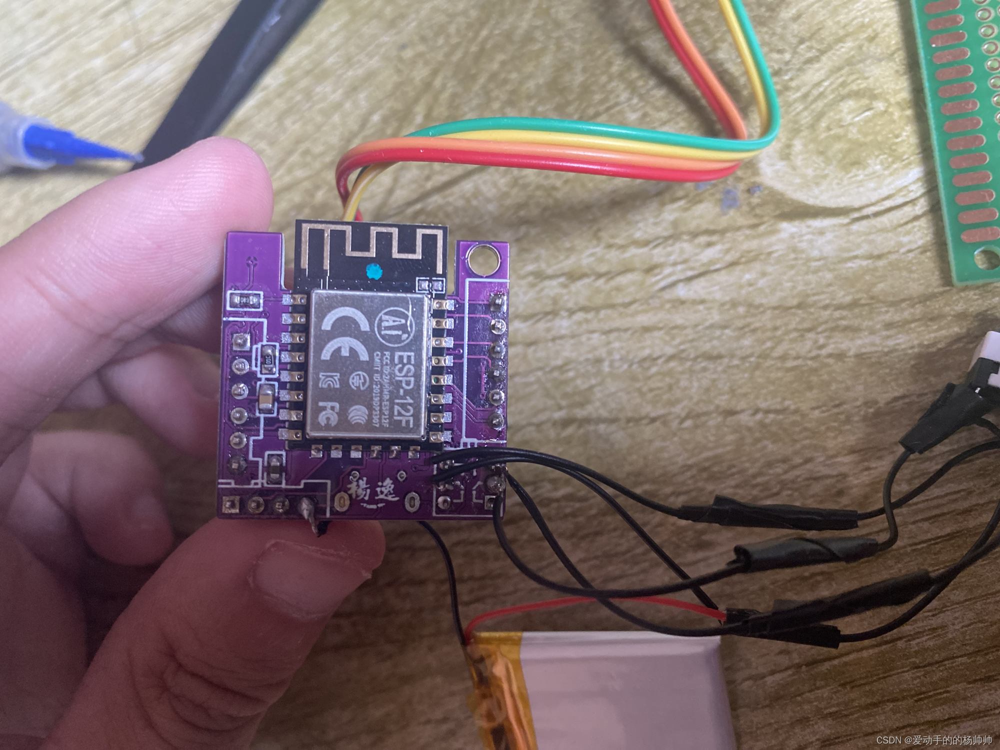
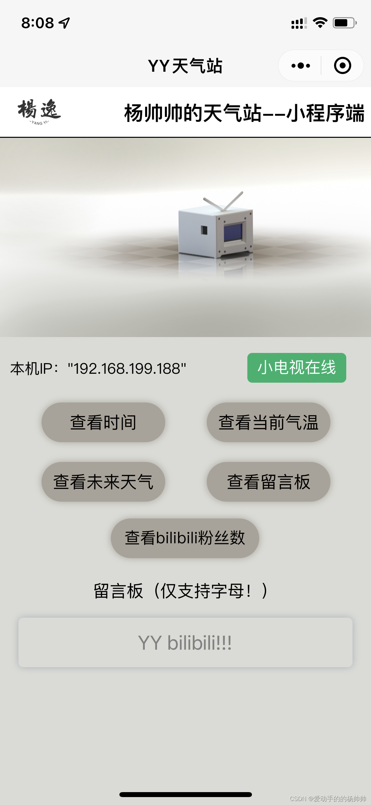

<h1 align="center">📺 Bilibili Weather TV — ESP8266 + WeChat Mini Program</h1>

  <b>ESP8266 × WeChat Mini Program × I²C OLED × 3D-printed Enclosure</b> 
  <i>A cross-disciplinary build that blends embedded firmware, PCB design, and industrial design.</i>

  
  
  

---

## Overview (EN)

This project is a desktop “Bilibili TV” powered by **ESP8266**.  
It connects to Wi-Fi, synchronizes time via **NTP**, fetches **weather** and **Bilibili stats**, and supports **on-device message display** sent from a **WeChat Mini Program**.  
The hardware integrates USB/Li-ion power management and a 0.96″ I²C OLED; the enclosure is modeled in SolidWorks and 3D-printed.

### Key Features
- 🌤️ Weather via HTTP/JSON; configurable city and units  
- ⏰ Precise time using NTP with reconnect and fallback  
- 📊 Bilibili stats (e.g., views/followers) display rotation  
- 💬 Message board via UDP packets from the mini program  
- 🔋 Power solution: USB + Li-ion with charging & 3.3 V regulation  
- 🧱 SolidWorks enclosure; STEP export for easy modification

---

## Gallery (EN)

  <table>
    <tr>
      <td align="center">
         
        Enclosure render (SolidWorks)
      </td>
      <td align="center">
         
        Main schematic (power / ESP8266 / I²C)
      </td>
    </tr>
    <tr>
      <td align="center">
         
        Assembled PCB (real photo)
      </td>
      <td align="center">
         
        WeChat Mini Program — send message / set device IP
      </td>
    </tr>
  </table>

---

## Repository Layout (EN)
